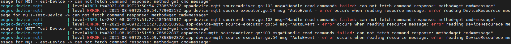
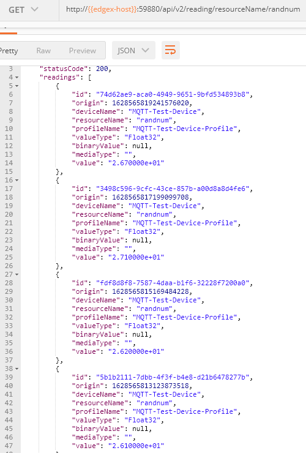

# Create EdgeX Mqtt Device
2021.08.09
* * * 
#### 참고사이트
+ EdgeX 공식사이트
https://docs.edgexfoundry.org/2.0/examples/Ch-ExamplesAddingMQTTDevice/

+ EdgeX docker builder
  https://github.com/edgexfoundry/edgex-compose/tree/main/compose-builder
* * * 
# 설치 
#### Docker를 이용해 EdgeX 시작
EdgeX Docker builder를 사용하여 EdgeX 서비스 세트에 대해 정의하고 있는 docker-compose.yml 파일을 생성한다.
본 데모에서는 v2.0(ireland)를 이용하였다.

```bash
git clone -b ireland https://github.com/edgexfoundry/edgex-compose
```
docker-compose 파일을 생성한다. 본 데모에서 정의한 서비스는 다음과 같다. 
+ mqtt-exporter
+ http-exporter
+ mqtt-device
+ http-device
+ virtual-device
+ (mqtt-broker) mqtt-device를 활성화하는 경우, 의존성에서 필요로 한다.
  
```bash
make gen no-secty ds-mqtt ds-rest asc-mqtt asc-http ds-virtual mqtt-broker
```
다음과 같은 docker-compose.yml 이 생성된다
[docker-compose.yml](./docker-compose.yml)

#### MQTT 가상 디바이스 생성
본 데모의 [mqtt-publisher](mqtt-publisher.py) 및 [mqtt-subscriber](mqtt-subscriber.py)코드로 가상 디바이스를 구성

#### device config 및 device profile 등록
[device config](custom-config/devices/mqtt.test.device.config.toml) 및 [device profile](custom-config/profiles/mqtt.test.device.profile.yml)을 device-mqtt 환경값 및 볼륨에 매핑
```yaml
  device-mqtt:
    ...
    environment:
      ...
      # custom-config
      DEVICE_DEVICESDIR: /custom-config/devices
      DEVICE_PROFILESDIR: /custom-config/profiles
      MQTTBROKERINFO_HOST: xxx.xxx.xxx.xxx
      MQTTBROKERINFO_PORT: xxxx
      ...
    volumes: 
    - ./custom-config:/custom-config
```

## 이슈
##### 1. 네이밍 불일치
해당 디바이스 네임을 찾지 못할 경우 다음과 같은 이슈가 발생한다

config.toml 파일의 네이밍을 일치시키니 정상적으로 동작
```toml
[[DeviceList]]
  Name = 'MQTT-Test-Device'
  ProfileName = 'MQTT-Test-Device-Profile'
  Description = 'MQTT device is created for test purpose'
  Labels = [ 'MQTT', 'test' ]
  [DeviceList.Protocols]
    [DeviceList.Protocols.mqtt]
       CommandTopic = 'CommandTopic'
    [[DeviceList.AutoEvents]]
       Interval = '30s'
       OnChange = false
       SourceName = 'message'
```
```python
import paho.mqtt.client as mqtt
from paho.mqtt import publish
import json, random, time

dataset = {
    "name": "MQTT-Test-device",
    "cmd": "randnum",
    "randnum": random.randrange(25, 29)
}

while True:
    time.sleep(2)
    publish.single("DataTopic", json.dumps(dataset),hostname="xxx.xxx.xxx.xxx", port=xxxx)
```

##### 2. 값 요청시 Connection refused 응답
```bash
curl http://xxx.xxx.xxx.xxx:59882/api/v2/device/all | json_pp

# error message
curl: (7) Failed to connect to xxx.xxx.xxx.xxx port 59882: Connection refused
```
docker-compose.yml의 포트포워딩 부분이 127.0.0.1로 잡혀있어 외부 접속을 막게 됨.
해당 부분을 수정하면 외부 접속이 가능하다.
```yaml
    # 수정 전
    ports:
    - 127.0.0.1:5563:5563/tcp
    - 127.0.0.1:59880:59880/tcp

    # 수정 후
    ports:
    - 5563:5563/tcp
    - 59880:59880/tcp
```
##### 3. device에서 해당 리소를 찾을 수 없다는 에러
```bash
edgex-device-mqtt          | level=ERROR ts=2021-08-10T03:23:10.230552685Z app=device-mqtt source=managedprofiles.go:129 msg="failed to find device MQTT-Test-device in cache"
edgex-device-mqtt          | level=ERROR ts=2021-08-10T03:23:10.230596864Z app=device-mqtt source=incominglistener.go:51 msg="[Incoming listener] Incoming reading ignored, device resource `randnum` not found from the device `MQTT-Test-device`"
```
디바이스에서 발행하는 메세지의 이름과 EdgeX에 등록된 디바이스의 명칭이 같지 않을 경우 발생.
```
# 디바이스로 등록된 이름은 'MQTT-Test-Device'

# published message
{
    "name": "MQTT-Test-device",
    "cmd": "randnum",
    "method": "get",
    "randnum": round(random.uniform(25, 29), 1)
}
```
위 코드에서 Device가 아닌 device라는 이름으로 보내고 있다. 이를 동일하게 맞춰주면 정상적으로 데이터 수집이 되는 것을 확인할 수 있다.
```bash
http://{{edgex-host}}:59882/api/v2/device/name/MQTT-Test-Device
```


#### 4. 이미 동작하는 중에 config파일들을 수정한다고 바로 반영되지 않는다.
